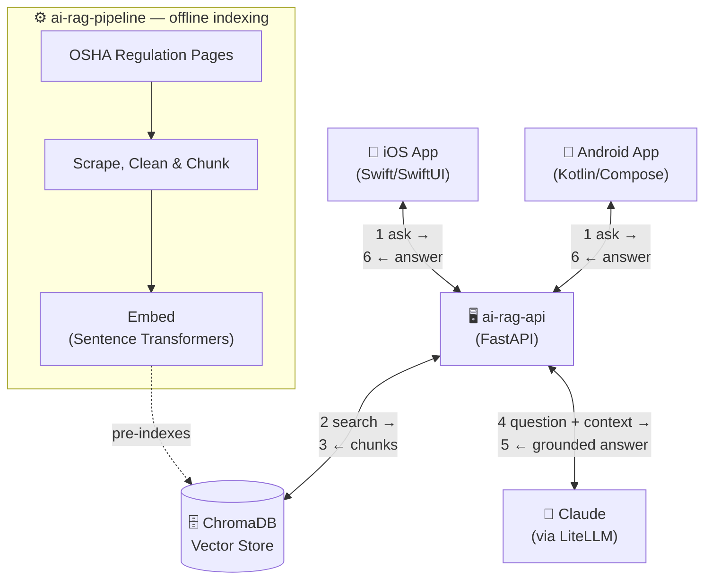

# AI RAG OSHA Demo - Apperdashery
*Artificial Intelligence · Retrieval-Augmented Generation · Occupational Safety and Health Administration*

## What it demonstrates
- AI engineering
- Retrieval-Augmented Generation (RAG)
- Document ingestion
- Vector search
- LLM integration
- Mobile AI integration
- FastAPI web service

## Business Use Cases

This architecture can be adapted for field service, construction, healthcare, financial services, insurance, manufacturing, and other environments where employees need rapid access to organizational knowledge.

https://github.com/user-attachments/assets/c4442a6a-e43d-419c-8f8a-f58dddf0c2e0

## Architecture

How a user's question flows through the system, end to end:

1. The user asks a question in the iOS or Android app, which is sent to **ai-rag-api**.
2. **ai-rag-api** embeds the question and searches **ChromaDB** for the most relevant OSHA regulation chunks (indexed ahead of time by **ai-rag-pipeline**). Retrieval happens entirely in the API — Claude never queries the vector store directly.
3. The API builds a prompt from the question plus the retrieved chunks and sends it to **Claude** (via LiteLLM).
4. Claude returns a grounded, cited answer as plain text, which the API relays back to the mobile app.

## ai-rag-pipeline
A retrieval and indexing pipeline for OSHA safety regulations.
It scrapes source pages, cleans and sections raw HTML, generates chunked JSONL records, embeds them with Sentence Transformers, and loads vectors into ChromaDB for downstream semantic retrieval.
Pipeline docs: [ai-rag-pipeline/README.md](ai-rag-pipeline/README.md)

## ai-rag-api
A FastAPI service that exposes health and OSHA PPE RAG endpoints.
It queries ChromaDB for relevant regulation chunks, uses Anthropic Claude (via LiteLLM) to produce grounded responses, and includes OpenAPI/Swagger docs for local testing.
API docs: [ai-rag-api/README.md](ai-rag-api/README.md)

## ai-rag-app
A native iOS app built with Swift and SwiftUI.
This client is intended to provide a mobile interface for OSHA PPE question/answer flows backed by the ai-rag-api service.
iOS docs: [ai-rag-app/README.md](ai-rag-app/README.md)

## ai-rag-android
A native Android app built with Kotlin and Jetpack Compose.
This client is intended to mirror the iOS experience and connect to the same FastAPI RAG backend for OSHA PPE guidance.
Android docs: [ai-rag-android/README.md](ai-rag-android/README.md)

